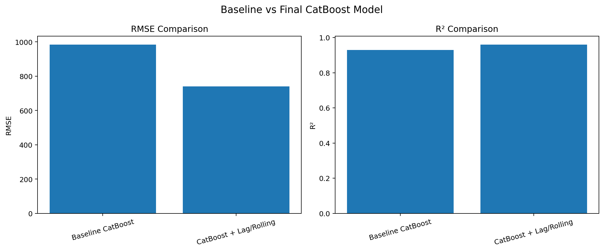
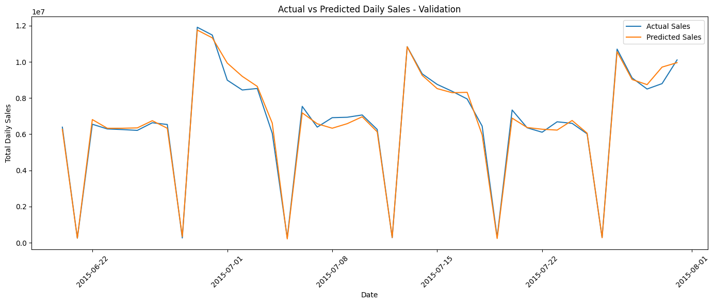
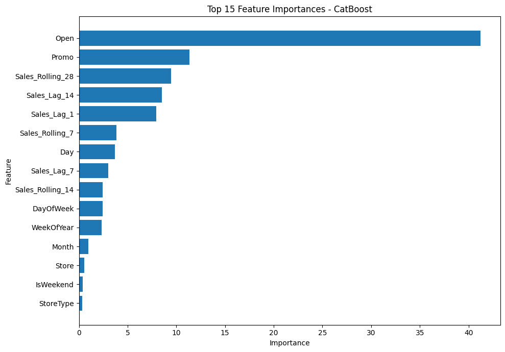

# Rossmann Demand Forecasting

Retail demand forecasting project using the Rossmann Store Sales dataset, CatBoost, and time-series feature engineering.

## Overview

This project focuses on predicting daily store-level sales using historical sales patterns, promotional activities, store characteristics, competition information, and calendar-based features.

The project uses chronological validation to prevent future information from leaking into the training process.

## Dataset

- **1,017,209** training records
- **1,115** stores
- Training period: **2013-01-01 → 2015-07-31**
- Test period: **2015-08-01 → 2015-09-17**
- **41,088** test records

## Project Workflow

- Data loading and quality analysis
- Missing-value analysis
- Duplicate detection
- Train and store data merging
- Exploratory data analysis
- Calendar feature engineering
- Time-based train/validation split
- Baseline CatBoost model
- Lag and rolling-window feature engineering
- Final CatBoost model
- Model evaluation
- Feature importance analysis
- Test-set forecasting

## Feature Engineering

### Calendar Features

- Year
- Month
- Day
- Week of Year
- Quarter
- Day of Week
- Weekend indicator

### Historical Sales Features

- `Sales_Lag_1`
- `Sales_Lag_7`
- `Sales_Lag_14`
- `Sales_Rolling_7`
- `Sales_Rolling_14`
- `Sales_Rolling_28`

Rolling features were calculated using previous observations only to avoid data leakage.

### Store and Business Features

- Store
- Store Type
- Assortment
- Competition Distance
- Competition Open Since
- Promo
- Promo2
- State Holiday
- School Holiday
- Promo Interval

## Model

The main machine learning algorithm used in this project is **CatBoost Regressor**.

Two models were developed and compared:

### Baseline CatBoost

The baseline model uses store, promotion, calendar, and store characteristics.

### CatBoost + Lag/Rolling Features

The final model incorporates historical sales behavior through lag and rolling-window features.

## Validation Strategy

A chronological split was used instead of a random train-test split.

**Training:** 2013-01-01 → 2015-06-19

**Validation:** 2015-06-20 → 2015-07-31

This approach reflects a real-world forecasting scenario where future observations are not available during training.

## Model Performance

| Model | MAE | RMSE | R² |
|---|---:|---:|---:|
| Baseline CatBoost | 658.37 | 984.85 | 0.9301 |
| **CatBoost + Lag/Rolling** | **475.96** | **740.65** | **0.9605** |

Adding lag and rolling-window features improved RMSE from **984.85 to 740.65**, representing an approximately **24.8% improvement**.

### Model Comparison



## Actual vs Predicted Sales

The final model closely follows the actual daily sales pattern during the validation period, including weekly fluctuations and major sales peaks.



## Feature Importance

The most important features identified by the final CatBoost model were:

| Feature | Importance |
|---|---:|
| Open | 41.21 |
| Promo | 11.33 |
| Sales_Rolling_28 | 9.47 |
| Sales_Lag_14 | 8.50 |
| Sales_Lag_1 | 7.92 |
| Sales_Rolling_7 | 3.84 |
| Day | 3.71 |
| Sales_Lag_7 | 3.02 |

The results indicate that store operating status, promotional activity, and historical demand patterns are the strongest predictors of sales.



## Test Forecasting

The final model generated predictions for all **41,088** test records.

The predictions were exported in Kaggle submission format:

```text
Id,Sales

Technologies
Python
Pandas
NumPy
Matplotlib
Scikit-learn
CatBoost
Google Colab
Jupyter Notebook

rossmann-demand-forecasting/
│
├── Demand_Forecasting_Rossmann.ipynb
├── README.md
├── actual_vs_predicted.png
├── feature_importance.png
└── model_comparison.png

Key Takeaway

Historical sales information provided substantial predictive value.

By adding lag and rolling-window features to the CatBoost model:

RMSE improved by 24.8%
MAE decreased from 658.37 to 475.96
R² increased from 0.9301 to 0.9605

This project demonstrates an end-to-end demand forecasting workflow combining business-oriented features, time-series feature engineering, machine learning, and model evaluation.
